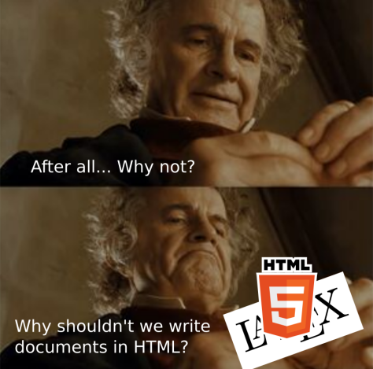

# HTML scientific documents

I want to replace the PDF format, which is tied to the concept of a paper-printed document, with something more flexible and interactive.

## Examples

- [On the Einstein Podolsky Rosen Paradox](https://sengerm.github.io/html-academic-publishing/examples/1964_Bell/Bell_1964_On%20the%20Einstein%20Podolsky%20Rosen%20paradox.html). A classic paper transcribed (for testing purposes) to HTML, making it easy to read in a mobile.
- [Example with interactive plots](https://sengerm.github.io/html-github-hosting/210425_spacial_resolution_of_AC-LGAD_within_a_pad/210425_spacial_resolution_of_AC-LGAD_within_a_pad.html). A document with interactive plots that you can zoom, enable/disable traces, etc.
- [Example of "slides"](https://sengerm.github.io/TIPP2021/). "Slides" used in a presentation including interactive plots that were very handy to show the global picture and the details of the data.
- [The documentation of this](https://sengerm.github.io/html-academic-publishing/#Examples). The documentation is written using the thing they are documenting.

## Tested

As of September 2021 this was tasted in:

- Linux: Firefox, Brave, Chromium.
- Windows: Chrome, Firefox, Edge.
- Android: Chrome, Firefox, Brave.
- Apple: Not sure which browser, but I know it worked out of the box.

In all cases no issues were found ✅.

## Documentation

You can find documentation [here](https://sengerm.github.io/html-academic-publishing/).

## Installation

You don't need to install anything as you already have a web browser (Firefox, Chrome, etc., whichever you want) and a text editor (Notepad, etc.). Just download any of the [examples](examples), open it with the web browser and simultaneously with the text editor, modify it in the text editor and refresh the browser to see the changes. You can also use [the documentation file](index.html) as a template, it contains at least one example of every thing you can do with this.

## LyX → HTML

[LyX](https://www.lyx.org/) is a really nice software for writing scientific documents, it implements a graphical interface and writes LaTeX in the background. In the normal workflow you end up with a nice PDF file created by LaTeX. But what if you want an HTML? LyX offers some built in options to export HTML, but they are not nice.

I implemented a simple [Python script](python/lyx_to_html.py) to export a limited subset of what you can do in LyX into a nice HTML.

